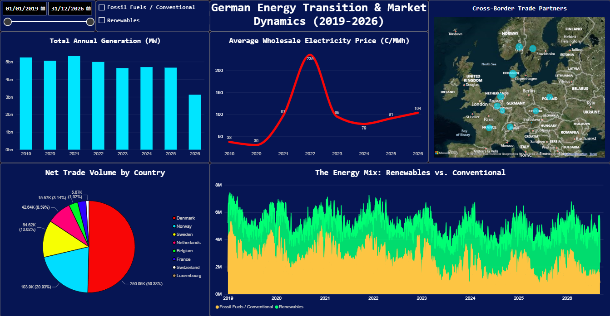
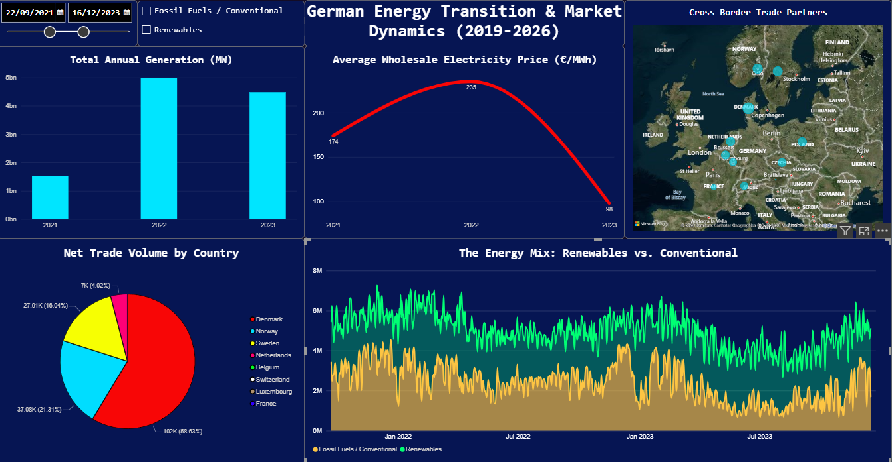
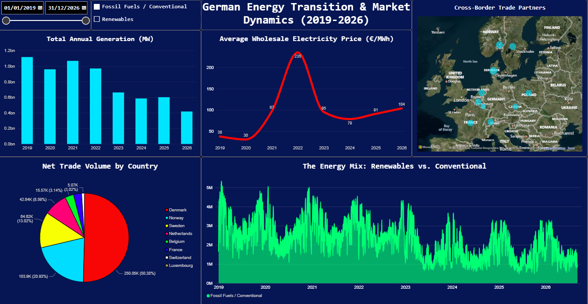

# Strommarkt-Dashboard Deutschland

Ein kleines Python-Skript holt Stromdaten aus Deutschland von der API von
**energy-charts.info** (vom Fraunhofer ISE). Es speichert die Daten als
Parquet-Dateien. Ein Power-BI-Report zeigt sie dann als Grafiken: Strommix,
Preise, Handel mit den Nachbarländern und installierte Leistung.

Zeitraum: **Januar 2019 bis 7. September 2026.** 2026 ist noch nicht zu Ende,
also ist es kein ganzes Jahr. Die Stromdaten gibt es alle 15 Minuten, die Preise
jede Stunde.

## Das Dashboard



Die Seite zeigt: den Strom pro Jahr, den mittleren Preis über die Zeit, den
Strommix aus erneuerbarer und fossiler Erzeugung und den Handel mit den
Nachbarländern. Mit dem Datums-Regler oben wählt man einen Zeitraum. Dann ändern
sich alle Grafiken zusammen.

## Warum dieses Projekt

In Deutschland läuft eine große Energiewende. Vieles davon sieht man in offenen
Daten: den hohen Gaspreis 2022, das Aus für die letzten Atomkraftwerke, den
schnellen Ausbau von Solar und immer mehr Stunden mit negativen Strompreisen.
Dieses Projekt macht aus den API-Daten Grafiken, die man leicht lesen kann.

## Die Daten

Alle Daten kommen von `https://api.energy-charts.info`. **Man braucht keinen
API-Key und keine Anmeldung.** Es sind vier Endpunkte, pro Endpunkt eine
Parquet-Datei:

| Datei | Endpunkt | Was drin ist |
| --- | --- | --- |
| `data/de_public_power.parquet` | `/public_power` | Strom pro Quelle (Wind, Solar, Kohle, Gas, Atom …), dazu die Last und der Anteil der Erneuerbaren. Alle 15 Minuten. |
| `data/de_price.parquet` | `/price` | Börsenpreis für den nächsten Tag, in EUR/MWh, für die Preiszone `DE-LU`. Pro Stunde. |
| `data/de_cbet.parquet` | `/cbet` | Geplanter Stromhandel in GW, eine Spalte pro Nachbarland (+ heißt Import nach Deutschland, − heißt Export). |
| `data/de_installed_power_monthly.parquet`, `..._yearly.parquet` | `/installed_power` | Installierte Leistung pro Quelle in GW, pro Monat und pro Jahr. |

Die Parquet-Dateien sind klein (zusammen etwa 25 MB) und liegen direkt im Repo.
Man muss nichts extra herunterladen. Die Daten stehen unter der Lizenz CC BY 4.0.
Bitte als Quelle nennen: **Bundesnetzagentur | SMARD.de** und
**Energy-Charts.info (Fraunhofer ISE)**.

## Das Skript

`fetch_energy_charts.py` macht die ganze Arbeit. Für jeden Endpunkt gibt es eine
kleine Funktion (`public_power`, `price`, `cbet`, `installed_power`). Jede
Funktion holt die JSON-Daten, bringt sie in eine saubere Tabelle und stellt die
Zeit auf `Europe/Berlin` um.

Ein paar Punkte dazu:

- **Nur wenige Anfragen erlaubt.** Die API erlaubt etwa 2 Anfragen pro Minute.
  Darum wartet das Skript 35 Sekunden zwischen den Anfragen. Wenn trotzdem der
  Fehler HTTP 429 kommt, wartet es so lange, wie die API sagt, und versucht es
  dann noch einmal.
- **Ein Jahr pro Anfrage.** Das Skript holt die Daten Jahr für Jahr und setzt sie
  danach zusammen. Ein ganzer Lauf von 2019 bis 2026 dauert etwa 15 Minuten, weil
  das Skript oft wartet.
- **Parquet statt CSV.** Das Format ist klein und schnell. Es behält die Typen und
  die Zeitzone. pandas und Power BI können es direkt lesen.

## Starten

```bash
pip install -r requirements.txt
python fetch_energy_charts.py
```

Kurzer Test ohne den ganzen Lauf:

```python
from fetch_energy_charts import public_power
public_power("de", "2025-01-01", "2025-01-31").head()
```

## Wie der Report gebaut ist

`energie-daten-DE.pbix` – öffnen mit Power BI Desktop (kostenlos). Der Aufbau:

- **Power Query** lädt die Parquet-Dateien. Aus den vielen Spalten macht es eine
  lange Tabelle mit den Spalten `source` und `value`. Dann teilt es die Quellen in
  drei Gruppen: Erneuerbar, Fossil und Atom.
- **Sternschema:** eine Tabelle mit den Datumswerten ist mit Tabellen für Strom,
  Preis, Handel und Leistung verbunden.
- **DAX**-Formeln für den Anteil der Erneuerbaren, den Vergleich von Jahr zu Jahr,
  den mittleren Preis und Summen über 12 Monate.

Zum Aktualisieren: erst das Python-Skript neu laufen lassen. Dann in Power Query
den Ordner `data/` als Quelle wählen.

## Was die Zahlen sagen

Alle Zahlen kommen aus diesen Daten. **2026 geht nur bis zum 7. September.**

**Der Preis-Schock 2022.** Mittlerer Preis pro Jahr: 38 € (2019), 31 € (2020),
97 € (2021), **235 € (2022)**, 95 € (2023), 79 € (2024), 91 € (2025), 104 € (2026
bis jetzt). Der Wert von 2022 ist rund **8-mal so hoch** wie 2020. Auf dem
Strommarkt gibt es eine Regel: Das teuerste Kraftwerk, das gerade läuft, bestimmt
den Preis für alle. Als das Gas aus Russland fehlte, wurde Gas sehr teuer. Darum
stieg auch der Strompreis stark.



*Der gleiche Report, nur für Sep 2021 bis Dez 2023: Der Preis geht von 174 € auf
235 € und dann auf 98 €/MWh.*

**Atomkraft auf null.** Strom aus Atomkraft: 71 TWh (2019), 33 TWh (2022), 7 TWh
(2023), **0 ab 2024**. Die letzten drei Reaktoren wurden im April 2023
abgeschaltet. Erneuerbare Energie und ein kleinerer Verbrauch haben die Lücke
gefüllt, nicht neue Kohle- oder Gaskraftwerke.

**Erneuerbare über 60 %.** Der Anteil der Erneuerbaren am öffentlichen Strom stieg
von **rund 44 % (2019) auf rund 61 % (2024–2026)**. Der Grund ist vor allem Solar:
Der Strom aus Solar stieg von 42 auf 70 TWh, und die installierte Solarleistung
stieg von **46 auf 118 GW**. Die Windleistung an Land stieg von 53 auf 71 GW, auf
See von 7,7 auf 11 GW. Der fossile Strom sank von rund 208 auf rund 150 TWh.



*Nur die fossile Erzeugung: Sie geht über den ganzen Zeitraum nach unten.*

**Negative Preise sind normal geworden.** Stunden mit einem Preis unter null:
**211 (2019), 301 (2023), 724 (2025), 1.773 (2026 bis jetzt)**. Mittags gibt es
oft mehr Solarstrom als Bedarf. Kohle- und Gaskraftwerke können nicht so schnell
weniger produzieren. Das ist ein Problem bei der Energiewende: mehr Anlagen, aber
weniger Geld pro MWh.

**Mehr Strom im Winter.** Erneuerbare und fossile Erzeugung sind beide im Herbst
und Winter am höchsten und im Frühling und Sommer am tiefsten. Im Winter braucht
man mehr Strom (Heizung, Licht). Der Wind ist im Winter am stärksten. Aber der
Wind allein reicht nicht, darum laufen auch Kohle- und Gaskraftwerke mehr.

**Handel mit den Nachbarn.** Deutschland handelt die ganze Zeit mit Dänemark,
Frankreich, den Niederlanden, Norwegen und der Schweiz. Wenn viel Wind da ist,
verkauft Deutschland Strom ins Ausland. Wenn wenig Wind und Sonne da sind
(Dunkelflaute), kauft Deutschland Strom aus dem Ausland, zum Beispiel Atomstrom
aus Frankreich oder Wasserkraft aus Skandinavien.

## Wichtige Hinweise

- 2026 ist kein ganzes Jahr. Die Jahres-Summen für 2026 sind darum kleiner.
- `/public_power` ist nur der *öffentliche* Strom. Strom, den die Industrie selbst
  für sich macht, ist nicht dabei. Die echte Zahl ist also etwas höher.
- Die Preise gelten für die Preiszone `DE-LU` (Deutschland–Luxemburg).

## Technik

Python (requests, pandas, pyarrow) · Apache Parquet · Power BI Desktop (Power
Query, Sternschema, DAX)
