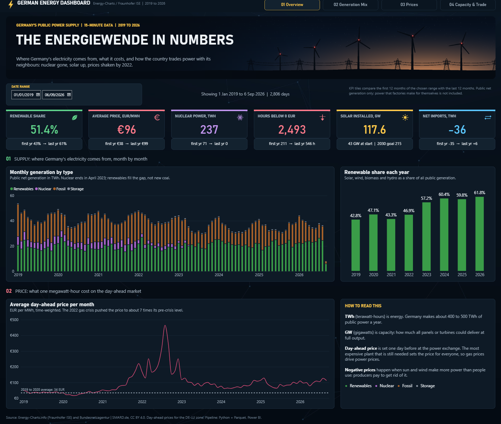
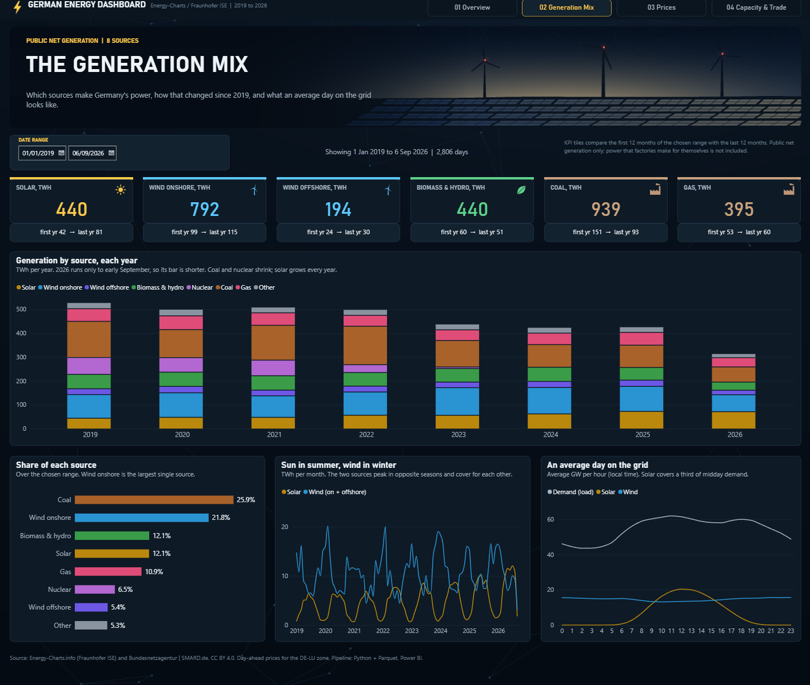
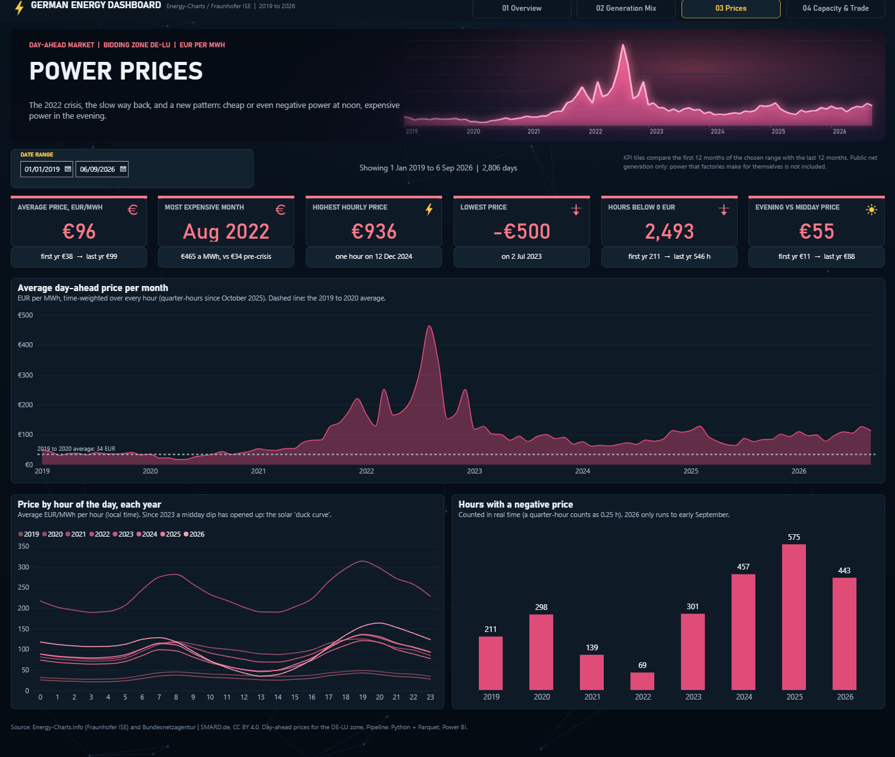
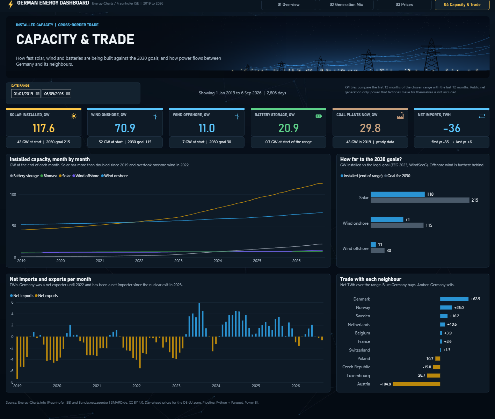

# Strommarkt-Dashboard Deutschland

Ein kleines Python-Skript holt Stromdaten aus Deutschland von der API von
**energy-charts.info** (vom Fraunhofer ISE). Es speichert die Daten als
Parquet-Dateien. Ein Power-BI-Report zeigt sie dann als Grafiken: Strommix,
Preise, Handel mit den Nachbarländern und installierte Leistung.

Zeitraum: **1. Januar 2019 bis 6. September 2026** (der letzte ganze Tag in den
Daten). 2026 ist noch nicht zu Ende, also ist es kein ganzes Jahr. Die Stromdaten
gibt es alle 15 Minuten. Die Preise gibt es bis September 2025 jede Stunde, seit
Oktober 2025 jede Viertelstunde.

## Das Dashboard

Der Report hat vier Seiten. Oben wählt man mit Knöpfen die Seite und mit dem
Datums-Regler den Zeitraum. Jede Seite hat oben sechs Kennzahlen. Unter jeder
Kennzahl steht ein Vergleich: die ersten 12 Monate des Zeitraums gegen die
letzten 12 Monate. So sieht man sofort, was sich verändert hat.

**1. Überblick:** Anteil der Erneuerbaren, Preis, Atomstrom, Stunden mit
negativem Preis, Solar-Leistung und Stromhandel. Dazu die Erzeugung pro Monat
(erneuerbar, Atom, fossil) und der mittlere Preis pro Monat.



**2. Strommix:** Erzeugung pro Quelle und Jahr (Solar, Wind an Land, Wind auf
See, Biomasse und Wasser, Atom, Kohle, Gas, Rest), der Anteil jeder Quelle,
Sonne im Sommer gegen Wind im Winter und ein mittlerer Tag im Stromnetz.



**3. Preise:** der Preis pro Monat mit der Krise 2022, der Preis für jede Stunde
des Tages pro Jahr (mittags wird Strom billig, abends teuer) und die Stunden mit
negativem Preis pro Jahr.



**4. Leistung & Handel:** wie schnell Solar, Wind und Batterien wachsen, wie weit
es noch bis zu den Zielen für 2030 ist, Import und Export pro Monat und der
Handel mit jedem Nachbarland.



## Warum dieses Projekt

In Deutschland läuft eine große Energiewende. Vieles davon sieht man in offenen
Daten: den hohen Gaspreis 2022, das Aus für die letzten Atomkraftwerke, den
schnellen Ausbau von Solar und immer mehr Stunden mit negativen Strompreisen.
Dieses Projekt macht aus den API-Daten Grafiken, die man leicht lesen kann.

## Die Daten

Alle Daten kommen von `https://api.energy-charts.info`. **Man braucht keinen
API-Key und keine Anmeldung.** Es sind vier Endpunkte, pro Endpunkt eine
Parquet-Datei:

| Datei | Endpunkt | Was drin ist |
| --- | --- | --- |
| `data/de_public_power.parquet` | `/public_power` | Strom pro Quelle (Wind, Solar, Kohle, Gas, Atom …), dazu die Last und der Anteil der Erneuerbaren. Alle 15 Minuten. |
| `data/de_price.parquet` | `/price` | Börsenpreis für den nächsten Tag, in EUR/MWh, für die Preiszone `DE-LU`. Pro Stunde. |
| `data/de_cbet.parquet` | `/cbet` | Geplanter Stromhandel in GW, eine Spalte pro Nachbarland (+ heißt Import nach Deutschland, − heißt Export). |
| `data/de_installed_power_monthly.parquet`, `..._yearly.parquet` | `/installed_power` | Installierte Leistung pro Quelle in GW, pro Monat und pro Jahr. |

Die Parquet-Dateien sind klein (zusammen etwa 25 MB) und liegen direkt im Repo.
Man muss nichts extra herunterladen. Die Daten stehen unter der Lizenz CC BY 4.0.
Bitte als Quelle nennen: **Bundesnetzagentur | SMARD.de** und
**Energy-Charts.info (Fraunhofer ISE)**.

## Das Skript

`fetch_energy_charts.py` macht die ganze Arbeit. Für jeden Endpunkt gibt es eine
kleine Funktion (`public_power`, `price`, `cbet`, `installed_power`). Jede
Funktion holt die JSON-Daten, bringt sie in eine saubere Tabelle und stellt die
Zeit auf `Europe/Berlin` um.

Ein paar Punkte dazu:

- **Nur wenige Anfragen erlaubt.** Die API erlaubt etwa 2 Anfragen pro Minute.
  Darum wartet das Skript 35 Sekunden zwischen den Anfragen. Wenn trotzdem der
  Fehler HTTP 429 kommt, wartet es so lange, wie die API sagt, und versucht es
  dann noch einmal.
- **Ein Jahr pro Anfrage.** Das Skript holt die Daten Jahr für Jahr und setzt sie
  danach zusammen. Ein ganzer Lauf von 2019 bis 2026 dauert etwa 15 Minuten, weil
  das Skript oft wartet.
- **Parquet statt CSV.** Das Format ist klein und schnell. Es behält die Typen und
  die Zeitzone. pandas und Power BI können es direkt lesen.

## Starten

```bash
pip install -r requirements.txt
python fetch_energy_charts.py        # Rohdaten holen (etwa 15 Minuten)
python prepare_dashboard_data.py     # kleine Tabellen für Power BI bauen (wenige Sekunden)
```

`prepare_dashboard_data.py` rechnet die 15-Minuten-Werte (MW) in Energie pro Tag
(GWh) um und schreibt sechs kleine Parquet-Dateien nach `data/dashboard/`:
Erzeugung pro Tag und Quelle, Preis und Last pro Tag, ein Tagesprofil pro Monat
und Stunde, Handel pro Tag und Land sowie die installierte Leistung. Zwei Punkte
sind dabei wichtig:

- **Stunden richtig zählen.** Seit Oktober 2025 gibt es vier Preise pro Stunde.
  Jede Zeile zählt darum mit ihrer Dauer (0,25 h oder 1 h). Der mittlere Preis ist
  nach der Zeit gewichtet.
- **Nur ganze Tage.** Der letzte Tag der Rohdaten ist oft nur halb da. Das Skript
  lässt ihn weg, damit die Summen stimmen.

Kurzer Test ohne den ganzen Lauf:

```python
from fetch_energy_charts import public_power
public_power("de", "2025-01-01", "2025-01-31").head()
```

## Wie der Report gebaut ist

Der Report liegt in `powerbi/` als **Power-BI-Projekt** (`.pbip`). Das ist eine
Sammlung von Textdateien, die man mit Git gut vergleichen kann. Öffnen mit Power BI
Desktop (kostenlos): `powerbi/energie-daten-DE.pbip`.

- `energie-daten-DE.SemanticModel/` – das Datenmodell: sechs Tabellen aus
  `data/dashboard/`, eine Kalender-Tabelle und 67 DAX-Measures.
- `energie-daten-DE.Report/` – die vier Seiten. Die Bilder (Banner, Hintergrund,
  Symbole) sind selbst gezeichnet und liegen in `StaticResources/`.
- `energie-daten-DE_v1_original.pbix` – meine erste Version des Reports (eine
  Seite), zum Vergleich.

Der Aufbau des Modells:

- **Sternschema:** die Kalender-Tabelle ist mit Erzeugung, Preis, Handel,
  Tagesprofil und Leistung verbunden. Der Datums-Regler filtert darum alles.
- **DAX** für den Anteil der Erneuerbaren, den zeitgewichteten Preis, die ersten
  gegen die letzten 12 Monate, den Abstand zu den Zielen für 2030 und die Farbe der
  Balken beim Handel.

**Zum Aktualisieren:** erst die zwei Python-Skripte laufen lassen, dann in Power
BI auf *Aktualisieren* klicken. Die Pfade zu den Parquet-Dateien sind feste Pfade
auf meinem Rechner. Wer das Repo woanders hat, ändert in Power Query den Pfad zu
`data/dashboard/`.

## Was die Zahlen sagen

Alle Zahlen kommen aus diesen Daten. **2026 geht nur bis zum 6. September.**

**Der Preis-Schock 2022.** Mittlerer Preis pro Jahr: 38 € (2019), 31 € (2020),
97 € (2021), **235 € (2022)**, 95 € (2023), 79 € (2024), 91 € (2025), 104 € (2026
bis jetzt). Der Wert von 2022 ist rund **8-mal so hoch** wie 2020. Auf dem
Strommarkt gibt es eine Regel: Das teuerste Kraftwerk, das gerade läuft, bestimmt
den Preis für alle. Als das Gas aus Russland fehlte, wurde Gas sehr teuer. Darum
stieg auch der Strompreis stark. Der teuerste Monat war der **August 2022** mit
rund 465 €/MWh im Mittel. Vor der Krise (2019–2020) waren es 34 €/MWh.

**Atomkraft auf null.** Strom aus Atomkraft: 71 TWh (2019), 33 TWh (2022), 7 TWh
(2023), **0 ab 2024**. Die letzten drei Reaktoren wurden im April 2023
abgeschaltet. Erneuerbare Energie und ein kleinerer Verbrauch haben die Lücke
gefüllt, nicht neue Kohle- oder Gaskraftwerke.

**Erneuerbare über 60 %.** Der Anteil der Erneuerbaren am öffentlichen Strom stieg
von **rund 44 % (2019) auf rund 61 % (2024–2026)**. Der Grund ist vor allem Solar:
Der Strom aus Solar stieg von 42 auf 70 TWh, und die installierte Solarleistung
stieg von **46 auf 118 GW**. Die Windleistung an Land stieg von 53 auf 71 GW, auf
See von 7,7 auf 11 GW. Der fossile Strom sank von rund 208 auf rund 150 TWh.
Batteriespeicher wuchsen von 0,7 GW (Januar 2019) auf 21 GW. Bis zu den Zielen für 2030 ist es aber
noch weit: Solar hat 118 von 215 GW, Wind auf See 11 von 30 GW.

**Negative Preise sind normal geworden.** Stunden mit einem Preis unter null:
**211 (2019), 301 (2023), 457 (2024), 575 (2025), 443 (2026 bis jetzt)**. Seit
Oktober 2025 gibt es Preise pro Viertelstunde; eine Viertelstunde zählt darum als
0,25 Stunden. Mittags gibt es oft mehr Solarstrom als Bedarf. Kohle- und
Gaskraftwerke können nicht so schnell weniger produzieren. Das ist ein Problem bei
der Energiewende: mehr Anlagen, aber weniger Geld pro MWh. Man sieht es auch am
Preis über den Tag: 2019 kostete Strom mittags und abends fast gleich viel. In den
letzten 12 Monaten war er abends im Mittel **88 €/MWh teurer** als mittags.

**Mehr Strom im Winter.** Erneuerbare und fossile Erzeugung sind beide im Herbst
und Winter am höchsten und im Frühling und Sommer am tiefsten. Im Winter braucht
man mehr Strom (Heizung, Licht). Der Wind ist im Winter am stärksten. Aber der
Wind allein reicht nicht, darum laufen auch Kohle- und Gaskraftwerke mehr.

**Vom Exporteur zum Importeur.** Bis 2022 hat Deutschland mehr Strom verkauft als
gekauft (2019: 35 TWh mehr verkauft). Seit dem Atom-Aus 2023 kauft Deutschland
mehr, als es verkauft (2024: 28 TWh mehr gekauft). Am meisten kauft es aus
Dänemark (+62 TWh seit 2019), am meisten verkauft es nach Österreich (−105 TWh).

**Handel mit den Nachbarn.** Deutschland handelt die ganze Zeit mit Dänemark,
Frankreich, den Niederlanden, Norwegen und der Schweiz. Wenn viel Wind da ist,
verkauft Deutschland Strom ins Ausland. Wenn wenig Wind und Sonne da sind
(Dunkelflaute), kauft Deutschland Strom aus dem Ausland, zum Beispiel Atomstrom
aus Frankreich oder Wasserkraft aus Skandinavien.

## Wichtige Hinweise

- 2026 ist kein ganzes Jahr. Die Jahres-Summen für 2026 sind darum kleiner.
- `/public_power` ist nur der *öffentliche* Strom. Strom, den die Industrie selbst
  für sich macht, ist nicht dabei. Die echte Zahl ist also etwas höher.
- Die Preise gelten für die Preiszone `DE-LU` (Deutschland–Luxemburg).

## Technik

Python (requests, pandas, pyarrow) · Apache Parquet · Power BI Desktop als
Power-BI-Projekt (.pbip: TMDL-Modell, PBIR-Report; Power Query, Sternschema, DAX)

## Lizenzen

Im Repo gelten zwei Lizenzen, für zwei verschiedene Teile:

- **Code:** MIT (siehe [LICENSE](LICENSE)). Der Code und der Power-BI-Report
  gehören mir und dürfen frei genutzt werden.
- **Daten in `data/`:** CC BY 4.0 –
  <https://creativecommons.org/licenses/by/4.0/deed.de>.
  Quelle: Bundesnetzagentur | SMARD.de und Energy-Charts.info (Fraunhofer ISE).
  Die Rohdaten wurden nach Jahren zusammengefasst und ins Parquet-Format
  umgewandelt. Das Projekt wird von diesen Stellen nicht unterstützt und steht
  in keiner Verbindung zu ihnen.
